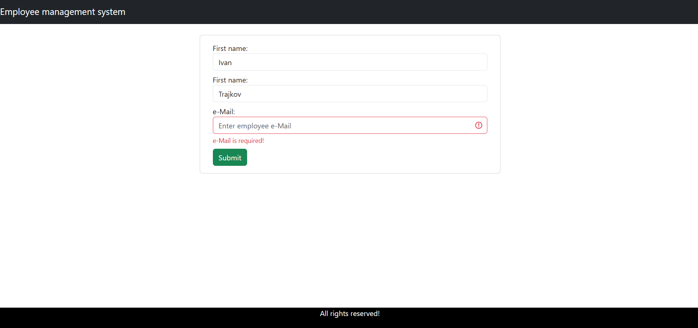

<h1>Employee management system project</h1>

<h2>Problem description</h2>
<p>
This application is an implementation of a CRUD-operations Java back-end and React front-end to showcase a simple system for managing employees.<br>
The back-end code is following the MVC design pattern.<br>
The application is dockerized and can be easily started using "docker compose up"
</p>
<br>
 
<h2>Showcase:</h2>
<p><b>The interface of the app</b></p>

<p><b>Adding a new Employee</b></p>

<br>
<h2>Some details of the code</h2>
<p><b>Axios for sending simplified API requests</b></p>

```javascript
import axios from "axios"

const REST_API_BASE_URL = "http://localhost:8080/api/employees";

export const listEmployees = () => {
    return axios.get(REST_API_BASE_URL)
}

export const createEmployee = (employee) => axios.post(REST_API_BASE_URL, employee)
export const getEmployee = (employeeId) => axios.get(REST_API_BASE_URL + '/' + employeeId)
export const updateEmployee = (employeeId, employee) => axios.put(REST_API_BASE_URL + '/' + employeeId, employee)
export const deleteEmployee = (employeeId) => axios.delete(REST_API_BASE_URL + '/' + employeeId)
```
<p><b>The application is using DTOs to send objects between the two layers</b></p>

```java
package com.github.ivantrajkov.emsbackend.mapper;

import com.github.ivantrajkov.emsbackend.dto.EmployeeDto;
import com.github.ivantrajkov.emsbackend.entity.Employee;

public class EmployeeMapper {
    public static EmployeeDto mapToEmployeeDto(Employee employee) {
        return new EmployeeDto(
                employee.getId(),
                employee.getFirstName(),
                employee.getLastName(),
                employee.getEmail()
        );
    }

    public static Employee mapToEmployee(EmployeeDto employeeDto) {
        return new Employee(
                employeeDto.getId(),
                employeeDto.getFirstName(),
                employeeDto.getLastName(),
                employeeDto.getEmail()
        );
    }

}
```
<p><b>Controller</b></p>

```java
package com.github.ivantrajkov.emsbackend.controller;

import com.github.ivantrajkov.emsbackend.dto.EmployeeDto;
import com.github.ivantrajkov.emsbackend.entity.Employee;
import com.github.ivantrajkov.emsbackend.service.EmployeeService;
import org.springframework.http.HttpStatus;
import org.springframework.http.ResponseEntity;
import org.springframework.web.bind.annotation.*;

import java.util.List;

@CrossOrigin("*")
@RestController
@RequestMapping("/api/employees")
public class EmployeeController {
    private final EmployeeService employeeService;

    public EmployeeController(EmployeeService employeeService) {
        this.employeeService = employeeService;
    }

    @PostMapping
    public ResponseEntity<EmployeeDto> createEmployee(@RequestBody EmployeeDto employeeDto) {
        EmployeeDto savedEmployee = employeeService.createEmployee(employeeDto);
        return new ResponseEntity<>(savedEmployee, HttpStatus.CREATED);
    }

    @GetMapping("{id}")
    public ResponseEntity<EmployeeDto> getEmployee(@PathVariable("id") Long employeeId) {
        EmployeeDto employeeDto = employeeService.getEmployeeById(employeeId);
        return ResponseEntity.ok(employeeDto);
    }

    @GetMapping
    public ResponseEntity<List<EmployeeDto>> getAllEmployees() {
        List<EmployeeDto> employees = employeeService.getAllEmployees();
        return ResponseEntity.ok(employees);
    }

    @PutMapping("{id}")
    public ResponseEntity<EmployeeDto> updateEmployee
            (
                    @PathVariable("id") Long employeeId,
                    @RequestBody EmployeeDto updatedEmployee
            ) {
        EmployeeDto employeeDto = employeeService.updateEmployee(employeeId, updatedEmployee);
        return ResponseEntity.ok(employeeDto);
    }

    @DeleteMapping("{id}")
    public ResponseEntity<String> deleteEmployee(@PathVariable("id") Long employeeId) {
        employeeService.deleteEmployee(employeeId);
        return ResponseEntity.ok("Employee successfully deleted");
    }
}
```
<p><b>Service layer implementing the "EmployeeService" interface</b></p>

```java
package com.github.ivantrajkov.emsbackend.service.impl;

import com.github.ivantrajkov.emsbackend.dto.EmployeeDto;
import com.github.ivantrajkov.emsbackend.entity.Employee;
import com.github.ivantrajkov.emsbackend.exception.ResourceNotFoundException;
import com.github.ivantrajkov.emsbackend.mapper.EmployeeMapper;
import com.github.ivantrajkov.emsbackend.repository.EmployeeRepository;
import com.github.ivantrajkov.emsbackend.service.EmployeeService;
import org.springframework.stereotype.Service;

import java.util.List;

@Service
public class EmployeeServiceImpl implements EmployeeService {
    private final EmployeeRepository employeeRepository;

    public EmployeeServiceImpl(EmployeeRepository employeeRepository) {
        this.employeeRepository = employeeRepository;
    }

    @Override
    public EmployeeDto createEmployee(EmployeeDto employeeDto) {
        Employee employee = EmployeeMapper.mapToEmployee(employeeDto);
        Employee savedEmployee = employeeRepository.save(employee);

        return EmployeeMapper.mapToEmployeeDto(savedEmployee);
    }

    @Override
    public EmployeeDto getEmployeeById(Long employeeId) {
        Employee employee = employeeRepository
                .findById(employeeId)
                .orElseThrow(() -> new ResourceNotFoundException("Employee with the id: " + employeeId + " does not exist"));

        return EmployeeMapper.mapToEmployeeDto(employee);
    }

    @Override
    public List<EmployeeDto> getAllEmployees() {
        List<Employee> employees = employeeRepository.findAll();
        return employees.stream()
                .map(EmployeeMapper::mapToEmployeeDto).toList();
    }

    @Override
    public EmployeeDto updateEmployee(Long employeeId, EmployeeDto updatedEmployee) {
        Employee employee = employeeRepository.findById(employeeId)
                .orElseThrow((() -> new ResourceNotFoundException("Employee with id: " + employeeId + " does not exist")));
        employee.setFirstName(updatedEmployee.getFirstName());
        employee.setLastName(updatedEmployee.getLastName());
        employee.setEmail(updatedEmployee.getEmail());
        employeeRepository.save(employee);

        return EmployeeMapper.mapToEmployeeDto(employee);
    }

    @Override
    public void deleteEmployee(Long employeeId) {
        Employee employee = employeeRepository.findById(employeeId)
                .orElseThrow((() -> new ResourceNotFoundException("Employee with id: " + employeeId + " does not exist")));

        employeeRepository.delete(employee);
    }
}
```
